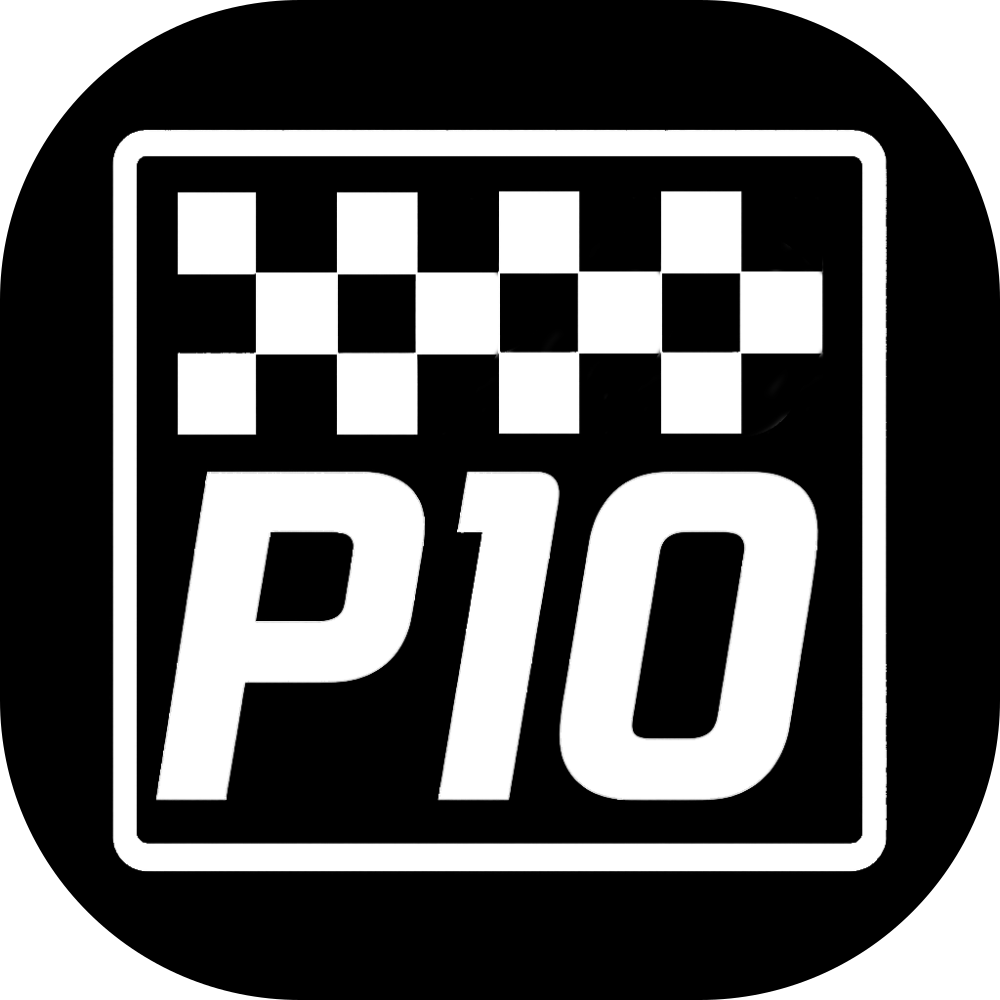

# P10 Game

This is the P10 Game Website, a silly game where players predict the driver who will qualify P10 for each race in the Formula 1 Season.

## 🚀 Getting Started

You can pull and run the prebuilt Docker image from GitHub Container Registry:

```bash
docker pull ghcr.io/teacupuk/p10:latest
```

This includes the full Laravel app and NGINX+PHP environment built into a single container.

You need to provide a Database Source to use - this can be configured in the env file.

Alternatively you can clone this repository and use the make build command to build the container.
